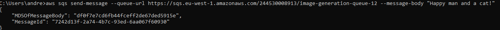

# Bemerkninger
Under eksamen har jeg merket at min kø "image-generation-queue-12" har blitt slettet flere ganger når jeg har startet opp å jobbe dagen etter f.eks.
Etter jeg hadde blitt ferdig med køen skulle jeg teste den dagen etter, da måtte jeg kjøre terraform apply for å generere den igjen.

# Oppgave 1
* A: https://0h0g99u485.execute-api.eu-west-1.amazonaws.com/Prod/generate
      Testet i Postman 
  * 
  * B: https://github.com/andreaskm/DevOpsEksamen2024/actions/runs/11802661435/job/32878811143
  * 
# Oppgave 2
  * Lenke til kjørt workflow i main: https://github.com/andreaskm/DevOpsEksamen2024/actions/runs/11817917899/job/32924343548
    * 
    * Lenke til kjørt workflow i not-main: https://github.com/andreaskm/DevOpsEksamen2024/actions/runs/11817972109/job/32924515789
    * 
    * SQS-Kø URL: https://sqs.eu-west-1.amazonaws.com/244530008913/image-generation-queue-12
    * 
    * Gir:
    * 
# Oppgave 3
  * Jeg valgte taggestrategien andreaskroger/imagegenerator12 for å assosiere imaget mitt med både prosjektet (imagegenerator12) og min Dockerhub-konto (andreaskroger). Det sørger for at docker imaget er unikt identifiserbart på dockerhub. Ved versjonering ville det vært nyttig å gi imaget en tag som f.eks. 1.0.0 for å tydeliggjøre små og store endringer. Dette vil gi en tydelig versjonskontroll.
  * Container image + SQS Url: andreaskroger/imagegenerator12 + https://sqs.eu-west-1.amazonaws.com/244530008913/image-generation-queue-12
# Oppgave 4
* 
* Jeg satt variabel "threshold" til 300 sekunder. Etter det vil jeg få en mail tilsendt

# Oppgave 5

## 1.	Automatisering og kontinuerlig levering

#### Serverless:

**Fordeler**:

* En serverless arkitektur vil gi meg små, enkeltstående funksjoner som kan være enklere å fordholde seg til i form av kontinuerlig levering. Med en zip fil sammen med infra koden vil man kunne rulle ut kode på samme måte som man har gjort tildigere, dermed er det veldig enkelt å holde styr på dersom man har god versjonskontroll.
* Deployment skjer raskt og enkelt per funksjon
* Enkelt å ta ned en funksjon dersom det skjer noe gærent, lite annet som blir påvirket

**Ulemper**:

- Ved f.eks. testing kan det være vanskeligere å forholde seg til i Severless arkitekturen ved at det blir mange små kompontenter å holde oversikt over.

#### Mikrotjenestearkitektur:

**Fordeler**:

- Siden tjenestene er større og mer selvstendige vil det gi enklere deployment, det vil bli mindre ‘Små’ (eks. lambda funksjoner) deler å deploye. CI/CD pipelines vil bli enklere å sette opp per mikrotjeneste.
- Versjonskontrollen blir enklere å holde styr på siden det er færre mindre biter i spill.
- Litt mer oversiktlig å jobbe på i lag

**Ulemper**:

- Dersom noe ikke går som det skal kan det være større deler av systemet som må ned for fiksing.
- Det tar lenger tid å rulle ut en oppdatering til systemet.

## 2.	Observability

#### Serverless:

**Fordeler**:

- På Amazon sine docs står: «AWS Lambda automatically monitors Lambda functions on your behalf to help you troubleshoot failures in your functions. As long as your function's execution role has the necessary permissions, Lambda captures logs for all requests handled by your function and sends them to Amazon CloudWatch Logs.». Dette vil gi enkel overvåking per Lambda-funksjon, og utvikleren trenger ikke å sette opp mer enn noen IAM permissions for at dette skal funke.
- Det kan bli enklere å finne feil knyttet til en enkelt funksjon.
- Lett å sette opp overvåkning på innebygde metrics, for så å knytte opp med mail, telefonnummer etc.

**Ulemper**

- Kompleksiteten kan øke siden man må observere mange små elementer.
- Det kan være vanskelig å samle relevante logger

#### Mikrotjenestearkitektur:

**Fordeler**:

- Alle logs per mikrotjeneste blir samlet på et sted, dermed kan det være mer oversiktlig.
- Ved hjelp av f.eks. grafana og loki kan man tilpasse loggene akkurat som man trenger, og samle de relevante loggene der man trenger de.

## 3.	Skalerbarhet og kostnadskontroll
Ved skalerbarhet og kostnadskontroll er det noen veldig vesentlige forskjeller på mikrotjenestearkitektur og serverlessarkitektur
#### Serverless:

**Fordeler**

- Du blir belastet kun for tiden funksjonen kjører på et millisekund nivå. Dette kan bringe svært kostnadseffektive løsninger.
- Kan være veldig godt egnet for uforutsigbare arbeidsmengder, da funksjonen kun kjøres når den må.

**Ulemper**

- Ved veldig mange kall på en funksjon kan det bli veldig dyrt i forhold til en tjeneste som lligger på en server.
- Hvis flere funksjoner skal kalle på hverandre kan det være problematisk med tanke på ytelse

#### Mikrotjenestearkitektur

**Fordeler**

- Kostnadene blir veldig mye mer forutsigbare når tjenesten kjøres på en server i for eksempel en docker-container

**Ulemper**

- Ved varierende belastning kan det være bedre med en serverless arkitektur da du kan betale for mye dødtid når mikrotjenesten skal befinner seg på en server og evt. Ikke bli benyttet.

## 4.	Eierskap og ansvar

#### Serverless arkitektur

**Fordeler**:

- Ettersom tjenestene ikke befinner seg på noen kjørende servere kan Utviklingsteamet fokusere på kode, og ikke drifting av server. Infrastrukturansvaret blir flyttet til skyleverandøren (Eks. AWS)
- Det kan bli mer spesialisering per funksjon, dermed kan forskjellige teams ha eierskap til forskjellige funksjoner

**Ulemper**

- Teams må forstå det tenkiske bak skyleverandørens tjenester, inkludert feilhåndtering og ytelse, noe som kan være tidkrevende opplæring
#### Mikrotjenestearkitektur

**Fordeler**
- Her kan teamene være mye mer dedikert per mikrotjeneste, noe som gir bedre oversikt i utvikingen.
- Teamet har mer kontroll over infrastrukturen, noe som kan hjelpe ved eventuelle feilmeldinger, og det gir bedre forståelse over kostnader og ytelsespåvirkninger

**Ulemper**

- Siden teamene må håndtere driften av infrastrukturen, kan det være tidkrevende å konfigurere, feilrette og oppdatere tjenesten

