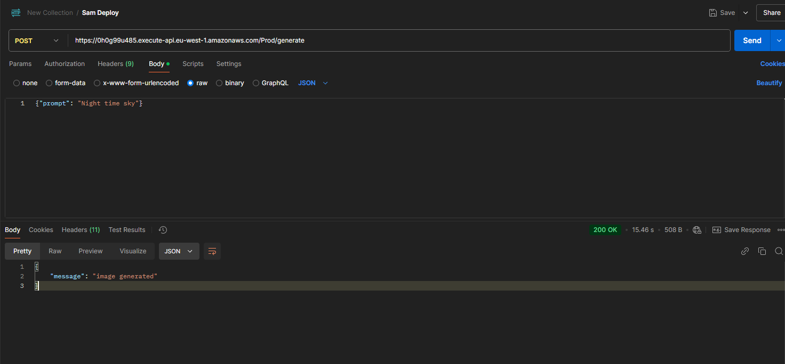

* # Oppgave 1
    * A: https://0h0g99u485.execute-api.eu-west-1.amazonaws.com/Prod/generate
          Testet i Postman 
    * 
    * B: https://github.com/andreaskm/DevOpsEksamen2024/actions/runs/11802661435/job/32878811143
    * 
* # Oppgave 2
    * Lenke til kjørt workflow i main: https://github.com/andreaskm/DevOpsEksamen2024/actions/runs/11817917899/job/32924343548
    * 
    * Lenke til kjørt workflow i not-main: https://github.com/andreaskm/DevOpsEksamen2024/actions/runs/11817972109/job/32924515789
    * 
    * SQS-Kø URL: https://sqs.eu-west-1.amazonaws.com/244530008913/image-generation-queue-12
    * 
    * Gir:
    * 
* # Oppgave 3
    * Jeg valgte taggestrategien andreaskroger/imagegenerator12 for å assosiere imaget mitt med både prosjektet (imagegenerator12) og min Dockerhub-konto (andreaskroger). Det sørger for at docker imaget er unikt identifiserbart på dockerhub. Ved versjonering ville det vært nyttig å gi imaget en tag som f.eks. 1.0.0 for å tydeliggjøre små og store endringer. Dette vil gi en tydelig versjonskontroll.
    * Container image + SQS Url: andreaskroger/imagegenerator12 + https://sqs.eu-west-1.amazonaws.com/244530008913/image-generation-queue-12
* # Oppgave 4
    * 1
    * 2
    * 3
    * 4

# docker
docker build . -t imagegenerator12 (12 for kandidatnummer)
docker tag imagegenerator12 andreaskroger/imagegenerator12
docker push andreaskroger/imagegenerator12 
